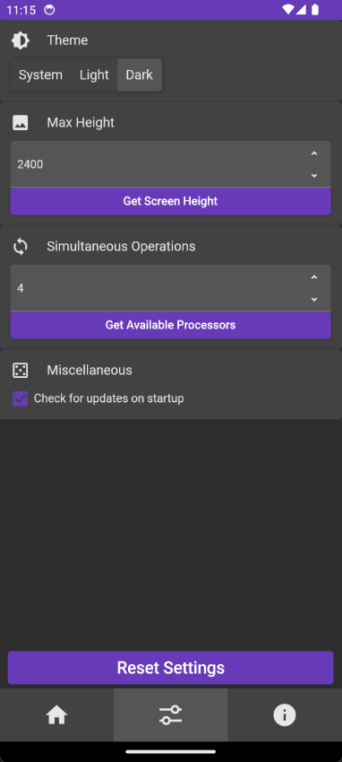

 

  

  <h3 align="center">Manhwa Splitter</h3>

  

    A cross-platform app for splitting long images.
     
     
    <a href="https://github.com/FawazTakahji/ManhwaSplitter/issues/new?assignees=FawazTakahji&labels=bug&projects=&template=bug_report.md&title=Bug+report%3A">Report Bug</a>
    .
    <a href="https://github.com/FawazTakahji/ManhwaSplitter/issues/new?assignees=FawazTakahji&labels=enhancement&projects=&template=feature_request.md&title=Feature+request%3A">Request Feature</a>
  

## Usage
Go to the
<a href="https://github.com/FawazTakahji/ManhwaSplitter/releases">releases</a>
page and download the version for your platform.

>Make sure to install the latest <a href="https://dotnet.microsoft.com/en-us/download/dotnet/8.0">.NET 8 runtime</a> on desktop.

## Platforms
* Windows 10 or later
* Linux
* Android 6 or later

## Acknowledgements

* [Avalonia](https://github.com/AvaloniaUI/Avalonia)
* [AvaloniaDialogs](https://github.com/Bip901/AvaloniaDialogs)
* [CommunityToolkit.Mvvm](https://github.com/CommunityToolkit/dotnet)
* [DesktopNotifications](https://github.com/pr8x/DesktopNotifications)
* [DialogHost.Avalonia](https://github.com/AvaloniaUtils/DialogHost.Avalonia)
* [ErrorOr](https://github.com/amantinband/error-or)
* [Font Awesome](https://fontawesome.com)
* [Icons.Avalonia](https://github.com/Projektanker/Icons.Avalonia)
* [Material.Avalonia](https://github.com/AvaloniaCommunity/Material.Avalonia)
* [Material.Icons](https://github.com/SKProCH/Material.Icons)
* [Microsoft.Extensions.DependencyInjection](https://github.com/dotnet/runtime)
* [Microsoft.Maui.Essentials](https://github.com/dotnet/maui)
* [NLog](https://github.com/NLog/NLog)
* [Octokit](https://github.com/octokit/octokit.net)
* [Pictogrammers](https://pictogrammers.com)
* [Semi Avalonia](https://github.com/irihitech/Semi.Avalonia)
* [SixLabors.ImageSharp](https://github.com/SixLabors/ImageSharp)
* [Svg.Skia](https://github.com/wieslawsoltes/Svg.Skia)
* [Ursa](https://github.com/irihitech/Ursa.Avalonia)

## Screenshots
### Desktop

### Mobile

